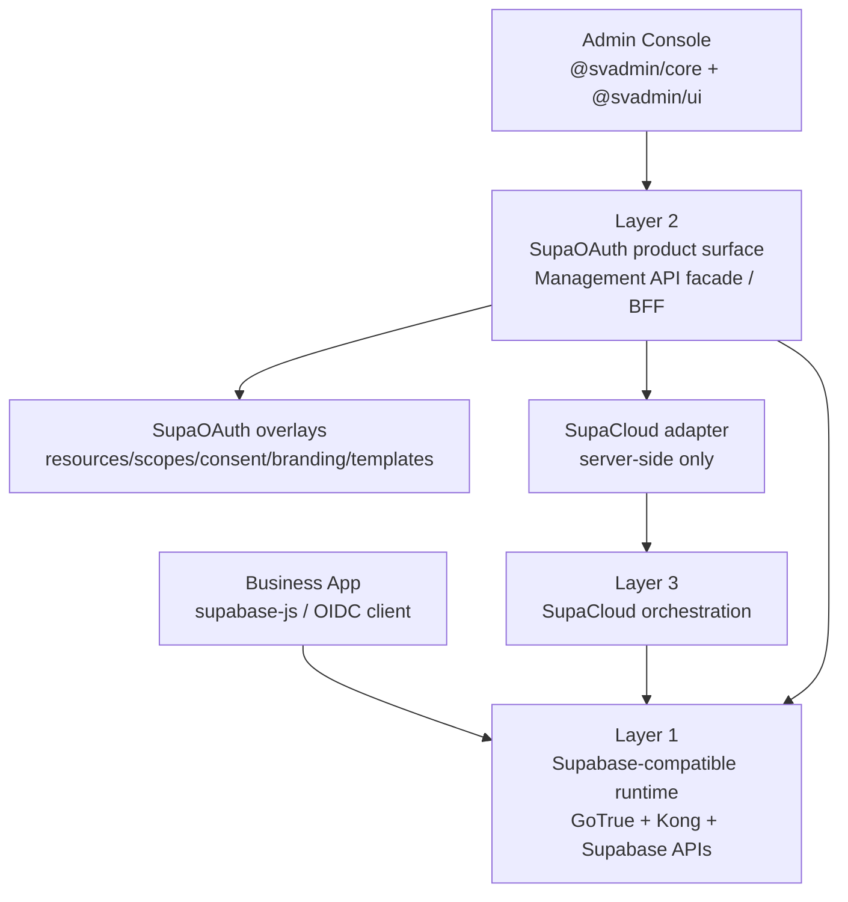

# SupaOAuth Architecture

## Baseline

SupaOAuth is organized as three explicit layers:

1. Supabase-compatible runtime
2. Logto-like product surface
3. SupaCloud orchestration

This split is the architecture baseline. It keeps SupaOAuth product-facing like Logto while preserving Supabase compatibility and avoiding direct infrastructure coupling in the admin console.

## SupaCloud-Native Direction

The target deployment model is SupAuth running inside SupaCloud, not beside it as
an extra production service. SupaCloud owns the identity management source of
truth; SupAuth provides the UI, hosted auth experience, function handlers, and
small product overlays. See `docs/supacloud-native-refactor.md`.

## Layer 1: Supabase-Compatible Runtime

Purpose: keep existing Supabase application behavior working.

Owned by:

- GoTrue
- Kong runtime routes
- Supabase-compatible services such as PostgREST, Storage, Realtime, and Edge Functions

Responsibilities:

- OIDC/OAuth protocol runtime
- Authorization code and token exchange
- Session handling
- JWT signing and JWKS
- `auth.users` as the primary identity table
- Supabase-compatible routes:
  - `/auth/v1/*`
  - `/rest/v1/*`
  - `/storage/v1/*`
  - `/realtime/v1/*`
  - `/.well-known/*`
- JWT claims required by RLS and Supabase clients:
  - `sub`
  - `role`
  - `aud`
  - `iss`
  - `exp`
  - `app_metadata`
  - `user_metadata`

Non-goals:

- Do not expose SupaOAuth management APIs from runtime paths.
- Do not rewrite Supabase client semantics.
- Do not break `supabase-js`, RLS, Storage, Realtime, or Functions authentication.

## Layer 2: Logto-Like Product Surface

Purpose: provide the SupaCloud-hosted user-center product experience without
becoming a second identity-management source of truth.

Owned by:

- `packages/auth-server`
- `packages/admin-console`
- `packages/shared`
- `packages/sdks`

Responsibilities:

- SupaCloud Function BFF and Management API facade
- Admin Console and SDKs
- API resources, scopes, and application/resource bindings
- Hosted auth pages, account claim pages, and sign-in experience overlays
- Connector visibility/display overlays on top of SupaCloud providers
- User management views and safe metadata extension workflows
- Consent, tenant branding/phrases, custom UI, and compatibility helpers
- Runtime health and compatibility inspection
- SupaCloud-owned management domains are proxied through server-side adapter calls:
  Applications, Users/sessions/MFA/passkeys, Organizations, RBAC, Audit,
  Webhooks, and Providers.

This layer stores only SupaOAuth overlay metadata. It must not become an
alternate GoTrue database, RBAC database, webhook store, audit store, or token
issuer in the default mode.

Default runtime mode:

- `runtime_mode=gotrue`
- GoTrue is the issuer.
- SupaOAuth is the SupaCloud Function BFF, overlay owner, API facade, and runtime verifier.

Advanced runtime mode:

- `runtime_mode=external_oidc`
- SupaOAuth or another IdP may be the issuer only if Supabase can trust it through OIDC discovery and asymmetric JWKS.
- This mode must be explicit and separately verified.

Non-goals:

- Do not reimplement token signing in the default mode.
- Do not manage Kong, GoTrue env files, or infrastructure directly from the browser.
- Do not put service-role, SupaCloud master, connector secret, or signing material in `VITE_*` variables.

## Layer 3: SupaCloud Orchestration

Purpose: apply product intent to infrastructure safely.

Owned by:

- `zuohuadong/supacloud`
- SupaCloud Management API
- SupaOAuth server-side SupaCloud adapter

Responsibilities:

- GoTrue instance lifecycle
- GoTrue environment injection
- GoTrue restart/reload orchestration
- Kong route and custom domain setup
- Supabase self-hosted project wiring
- User CRUD proxy
- MFA proxy
- Provider/connector secret delivery
- Applications, Organizations, RBAC, Audit, Webhooks, and user-session source of truth
- Managed webhook delivery and background jobs

Non-goals:

- SupaCloud should not define SupaOAuth product UX.
- Admin Console should not call SupaCloud directly.
- Browser code should never hold SupaCloud management credentials.

## Request Flow

## API Boundaries

Runtime APIs:

- Public to business applications.
- Must remain Supabase-compatible.
- Backed by GoTrue and Supabase runtime services.

Management APIs:

- Public only to authenticated admin console and SDK clients.
- Exposed by the SupAuth Function BFF.
- SupaCloud-owned domains are backed by SupaCloud Management API.
- SupaAuth overlay domains use the project database through the `supaoauth` schema.

Orchestration APIs:

- Internal server-to-server boundary.
- Called by SupaOAuth backend only.
- Never called directly from browser code.

## Design Rules

- SupaCloud-owned product objects live in SupaCloud Management API; SupaAuth stores only overlay fields that SupaCloud does not own.
- Runtime compatibility is a release blocker, not an optional feature.
- SupaOAuth should present a Logto-like product model but emit Supabase-compatible runtime behavior.
- Any feature that requires replacing GoTrue token semantics must be isolated behind `runtime_mode=external_oidc`.
- Claims added by SupaOAuth should use stable namespacing and must not break existing RLS policies.
- In `runtime_mode=gotrue`, RBAC should be read from SupaCloud and projected into `app_metadata.supaoauth` / RLS helper functions, not by changing the JWT `role` claim or writing local RBAC source tables.
- See `docs/rbac-supabase-compatibility.md` for the RBAC migration baseline.
