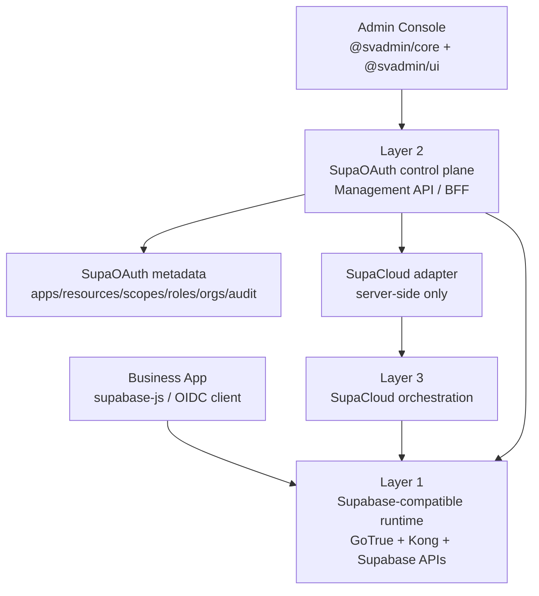

# SupaOAuth Architecture

## Baseline

SupaOAuth is organized as three explicit layers:

1. Supabase-compatible runtime
2. Logto-like product control plane
3. SupaCloud orchestration

This split is the architecture baseline. It keeps SupaOAuth product-facing like Logto while preserving Supabase compatibility and avoiding direct infrastructure coupling in the admin console.

## Layer 1: Supabase-Compatible Runtime

Purpose: keep existing Supabase application behavior working.

Owned by:

- GoTrue
- Kong runtime routes
- Supabase-compatible services such as PostgREST, Storage, Realtime, and Edge Functions

Responsibilities:

- OIDC/OAuth protocol runtime
- Authorization code and token exchange
- Session handling
- JWT signing and JWKS
- `auth.users` as the primary identity table
- Supabase-compatible routes:
  - `/auth/v1/*`
  - `/rest/v1/*`
  - `/storage/v1/*`
  - `/realtime/v1/*`
  - `/.well-known/*`
- JWT claims required by RLS and Supabase clients:
  - `sub`
  - `role`
  - `aud`
  - `iss`
  - `exp`
  - `app_metadata`
  - `user_metadata`

Non-goals:

- Do not expose SupaOAuth management APIs from runtime paths.
- Do not rewrite Supabase client semantics.
- Do not break `supabase-js`, RLS, Storage, Realtime, or Functions authentication.

## Layer 2: Logto-Like Product Control Plane

Purpose: provide the standalone user-center product experience.

Owned by:

- `packages/auth-server`
- `packages/admin-console`
- `packages/shared`
- `packages/sdks`

Responsibilities:

- Applications
- API resources
- Scopes
- Roles and permissions
- Organizations and members
- Social and enterprise connectors
- Sign-in experience configuration
- User management views and metadata extensions
- Audit logs
- Webhooks
- Management API and SDKs
- Runtime health and compatibility inspection

This layer stores SupaOAuth metadata. It should not become an alternate GoTrue database or token issuer in the default mode.

Default runtime mode:

- `runtime_mode=gotrue`
- GoTrue is the issuer.
- SupaOAuth is the control plane, BFF, metadata owner, and runtime verifier.

Advanced runtime mode:

- `runtime_mode=external_oidc`
- SupaOAuth or another IdP may be the issuer only if Supabase can trust it through OIDC discovery and asymmetric JWKS.
- This mode must be explicit and separately verified.

Non-goals:

- Do not reimplement token signing in the default mode.
- Do not manage Kong, GoTrue env files, or infrastructure directly from the browser.
- Do not put service-role, SupaCloud master, connector secret, or signing material in `VITE_*` variables.

## Layer 3: SupaCloud Orchestration

Purpose: apply product intent to infrastructure safely.

Owned by:

- `zuohuadong/supacloud`
- SupaCloud Management API
- SupaOAuth server-side SupaCloud adapter

Responsibilities:

- GoTrue instance lifecycle
- GoTrue environment injection
- GoTrue restart/reload orchestration
- Kong route and custom domain setup
- Supabase self-hosted project wiring
- User CRUD proxy
- MFA proxy
- Provider/connector secret delivery

Non-goals:

- SupaCloud should not define SupaOAuth product UX.
- Admin Console should not call SupaCloud directly.
- Browser code should never hold SupaCloud management credentials.

## Request Flow

## API Boundaries

Runtime APIs:

- Public to business applications.
- Must remain Supabase-compatible.
- Backed by GoTrue and Supabase runtime services.

Management APIs:

- Public only to authenticated admin console and SDK clients.
- Backed by SupaOAuth `auth-server`.
- Use server-side credentials to call SupaCloud.

Orchestration APIs:

- Internal server-to-server boundary.
- Called by SupaOAuth backend only.
- Never called directly from browser code.

## Design Rules

- Product objects live in SupaOAuth metadata first, then compile/sync into GoTrue/SupaCloud configuration as needed.
- Runtime compatibility is a release blocker, not an optional feature.
- SupaOAuth should present a Logto-like product model but emit Supabase-compatible runtime behavior.
- Any feature that requires replacing GoTrue token semantics must be isolated behind `runtime_mode=external_oidc`.
- Claims added by SupaOAuth should use stable namespacing and must not break existing RLS policies.

